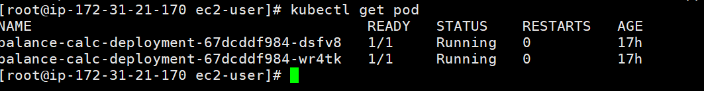
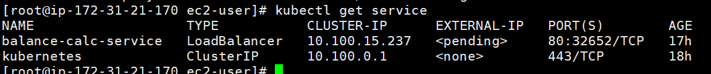

## 项目介绍

## 简介

基于spring boot3 + maven 构造的一个web服务，用于高并发场景下的实时交易系统，集成了AWS SQS, Amazon ElastiCache(Redis), AWS
RDS(mysq)。

支持亚马逊EKS部署从AWS ECR获取最新镜像进行部署。

## 项目设计架构

- [项目设计架构](./doc/detail.md)

## 建议

国内最好使用堡垒机部署，很多和外网不通

## 项目运行

- 该项目用 maven 构建的 springboot 项目，基础依赖 java SDK 21, maven 3.5+.

1. 确保安装好以上基础依赖后，如果在国内（大陆环境还可能需要配置maven的repository 镜像），克隆本仓库代码到本地
2. 使用IDEA自动打包或者进入到项目根目录执行 `mvn clean package`，会打包成 jar，在 target 目录中
3. 使用IDEA自动容器来运行盖项目
    - 启动时指定默认配置文件里面这个属性为dev，如果要部署到其他环境切换为dev,prod,test等
   ```
   spring.profiles.active=dev

   ```

## Docker部署运行

- 使用aws configure配置密钥凭证相关用于连接AWS ECR和 AWS EKS
- 登录AWS ECR
  ```
   aws ecr get-login-password --region <your-region> | docker login --username AWS --password-stdin <yourecr>
  ```
- 连接AWS EKS
  ```
   aws eks --region <your-region> update-kubeconfig --name <your-eks-cluster-name>
  ```
- 使用项目中的Dockfile进行打包，并通过docker push命令同送到AWS ECR仓库
- 前面的环境都准备好了后，执行命令进行部署docker
  [K8S部署文件](deployment.yaml)
  ```
  kubectl apply deployment.yaml
  ```
- 查看部署deployment,service
  
  

## 后期完善优化和扩展

- 优化参数方面校验，支持xml方式的配置集成spring sec安全插件
- 优化分布式锁（采用多线程的方式去获取分布式锁）
- 完善国际化
- 完善异常处理
- 密码安全处理
