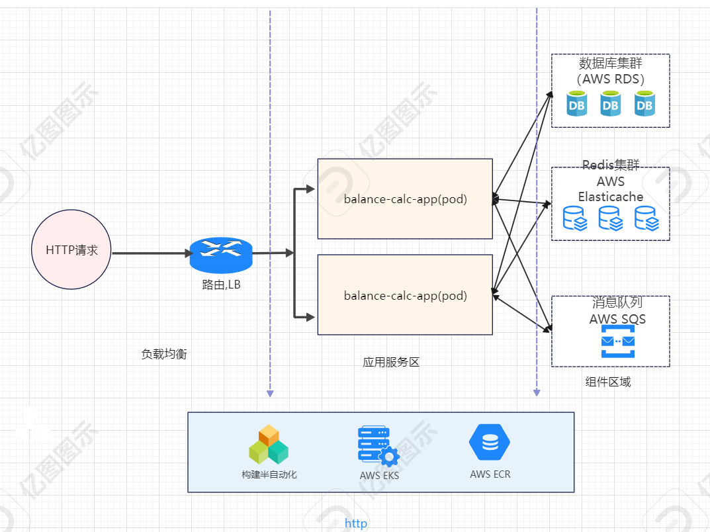
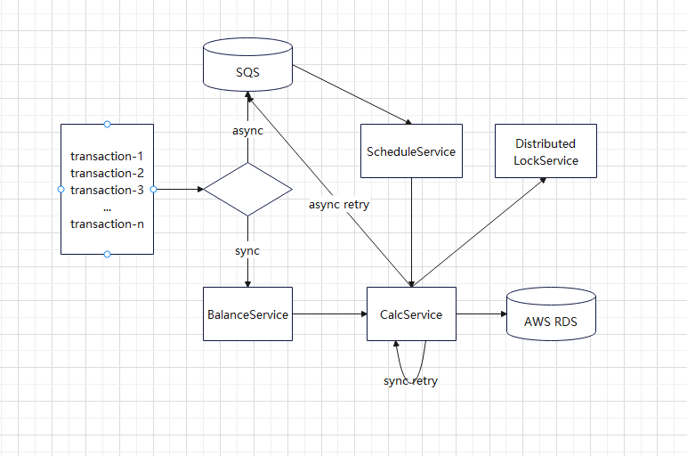
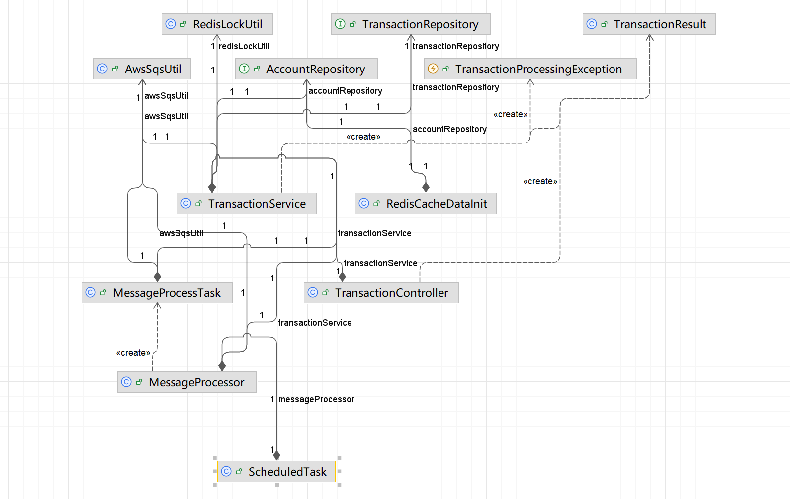

## 项目介绍

## 简介
基于spring boot3 + maven 构造的一个web服务，用于高并发场景下的实时交易。

### 工程化内容

- 工程化较为完备
  - 支持多 profile 配置
  - 容器化运行环境
  - 编译打包、镜像制作

- 考虑了安全问题 
   - 输入参数校验 
   - 修正了依赖里的安全问题，替换掉有漏洞的依赖版本

- 功能、性能问题
  - 提供了2个接口，一个同步接口和一个异步接口（http协议）
  - 多实例采用分布式锁提高性能，保证数据一致性。
  - 采用线程池的方式提交任务，提高并发处理能力。
  - 对消息的处理有确认操作，确保消息是消费了的。
 
### 架构

### 业务流程

### 类关系

 
