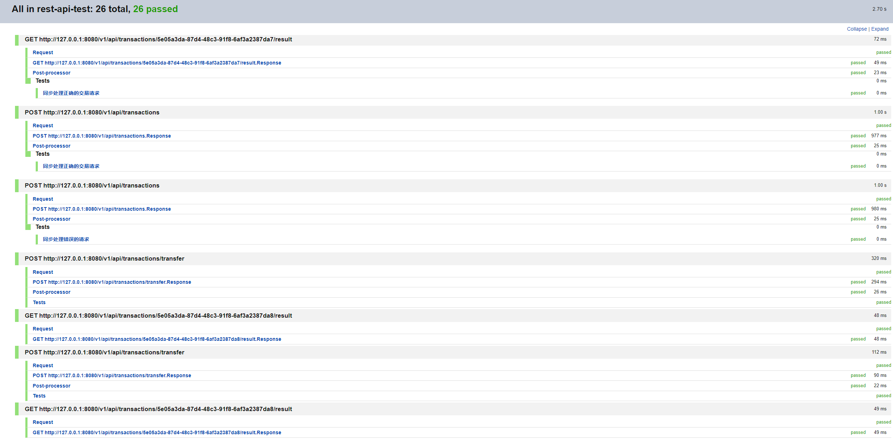

## 项目详情

## 简介

基于spring boot3 + maven 构造的一个web服务，用于高并发场景下的实时交易系统，集成了AWS SQS, Amazon ElastiCache(Redis), AWS RDS(mysq)。

支持亚马逊EKS部署从AWS ECR获取最新镜像进行部署。

- 工程支持多 profile 配置，容器化运行环境，编译打包、镜像制作。
- 考虑了安全问题
  - 输入参数校验
  - 修正了依赖里的安全问题，替换掉有漏洞的依赖版本
- 功能、性能问题
  - 提供了2个接口，一个同步接口和一个异步接口（http协议）
  - 多实例采用分布式锁提高性能，保证数据一致性。
  - 采用线程池的方式提交任务，提高并发处理能力。

### 架构


### 业务流程


### 类关系


### 视频讲解

<iframe width="560" height="315" src="https://www.yuque.com/u50764528/tccaef/fowazdl4m3a9gxf2?singleDoc# 《balance-vedio》" title="YouTube video player" frameborder="0" allow="accelerometer; autoplay; clipboard - write; encrypted - media; gyroscope; picture - in - picture; web - share" allowfullscreen></iframe>

  ```
        https://www.yuque.com/u50764528/tccaef/fowazdl4m3a9gxf2?singleDoc# 《balance-video》
  ```

### rest api 定义
  ```
  post /v1/api/transactions 同步方式处理交易
  post /v1/api/transactions/transfer 异步处理交易
  get  /v1/api/transactions/{transactionId}/result 获取异步处理交易的结果
  ```
  

### 数据库表设计以及脚本

- 账户表account
  - 该表主要有余额，账号和一个自增键
  - 增加了账户的唯一约束
- 交易表transaction
  - 该表主要有自增键，交易ID,源账户，目标账户，交易金额，时间戳
  - 增加了交易ID唯一约束，源账户，目标账户的外键约束

````
CREATE TABLE `account` (
   `id` BIGINT(20) NOT NULL AUTO_INCREMENT,
   `account_number` VARCHAR(255) NOT NULL,
   `balance` DECIMAL(10, 2) NOT NULL,
   PRIMARY KEY (`id`),
   UNIQUE KEY `uk_account_number` (`account_number`)
) ENGINE=InnoDB DEFAULT CHARSET=utf8mb4;

CREATE TABLE `transaction` (
   `id` BIGINT(20) NOT NULL AUTO_INCREMENT,
   `transaction_id` VARCHAR(255) NOT NULL,
   `source_account_number` VARCHAR(255) NOT NULL,
   `target_account_number` VARCHAR(255) NOT NULL,
   `amount` DECIMAL(10, 2) NOT NULL,
   `timestamp` BIGINT(20) NOT NULL,
   PRIMARY KEY (`id`),
   UNIQUE KEY `uk_transaction_id` (`transaction_id`),
   FOREIGN KEY (`source_account_number`) REFERENCES `account`(`account_number`),
   FOREIGN KEY (`target_account_number`) REFERENCES `account`(`account_number`)
) ENGINE=InnoDB DEFAULT CHARSET=utf8mb4;
//测试预置数据
insert into account(account_number, balance) values('111111111111',10000.00);
insert into account(account_number, balance) values('222222222221',2000.10);
insert into account(account_number, balance) values('111111111119',9988.90);
insert into account(account_number, balance) values('222222222229',2011.10);
insert into transaction(transaction_id, source_account_number, target_account_number, amount, timestamp) values  ('3bf5127c-f3d9-4d7a-9c00-4b2ab32faa5a','111111111111','222222222222',1.11,1736438275);
````

### 高速缓存

- 使用亚马逊的Amazon ElastiCache(Redis)集群简单实现了缓存，后续可优化

### 分布式锁

- 使用亚马逊的Amazon ElastiCache(Redis) 中天然支持的lua脚本实现分布式锁，确保集群节点，线程的数据安全和一致性

### 测试结果

- API-test
  
  - aws test
    
    
- UNIT-test
  
  由于时间紧张，没有对项目进行压力，有时间可以进行Apache JMeter的压力测试。
## 后期完善优化和扩展

- 优化参数方面校验，支持xml方式的配置集成spring sec安全插件
- 优化分布式锁（采用多线程的方式去获取分布式锁）
- 完善国际化
- 完善异常处理
- 密码安全处理
